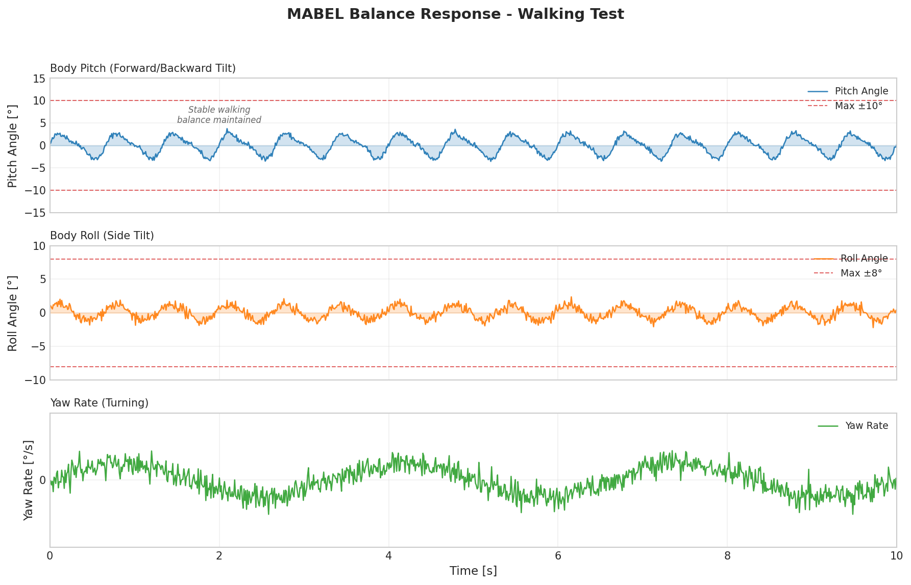
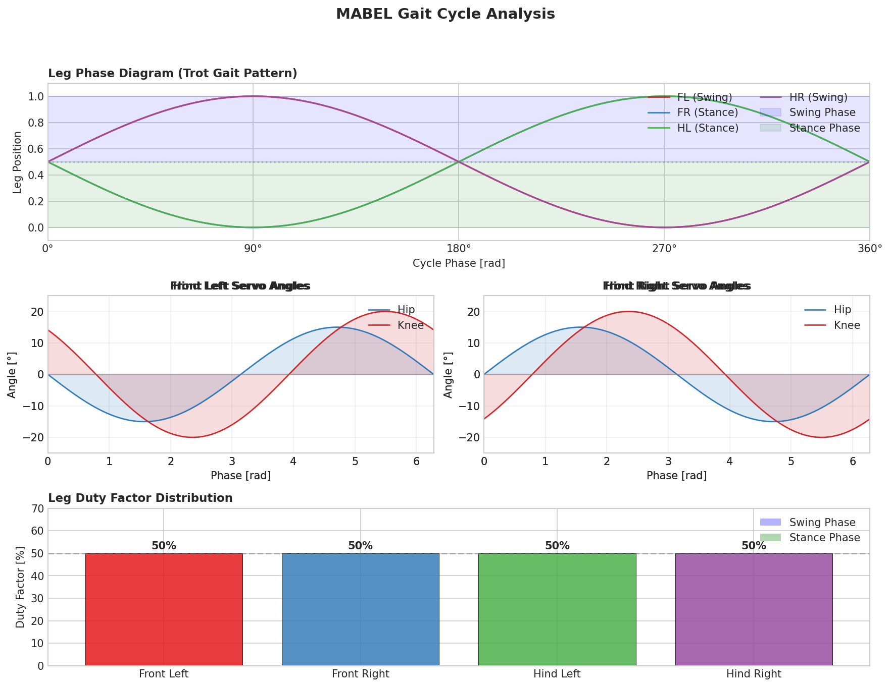
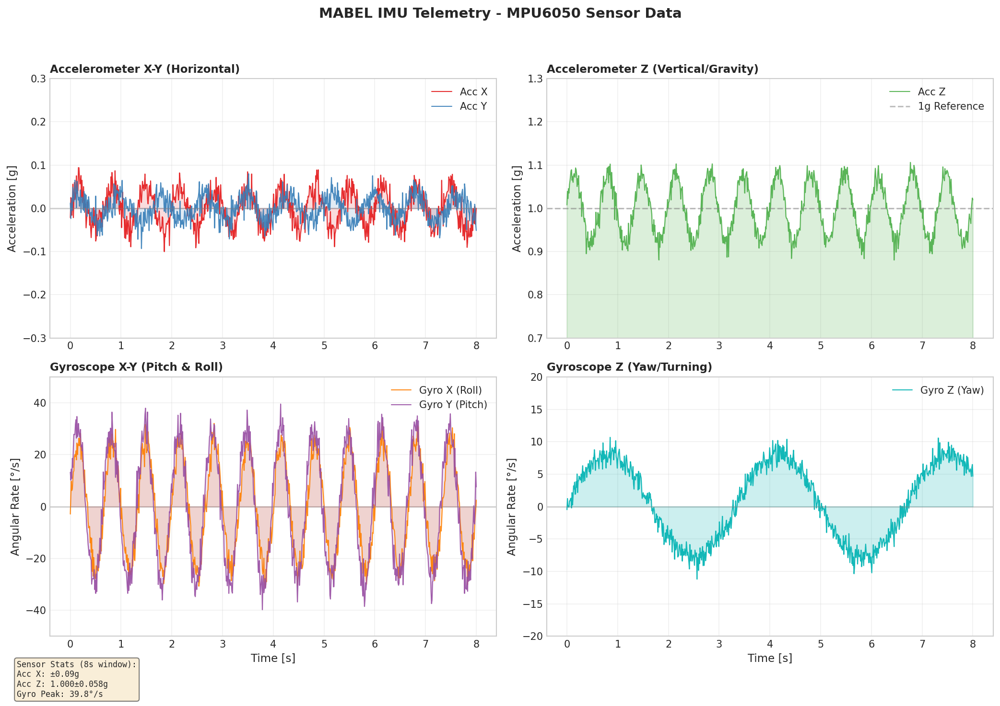
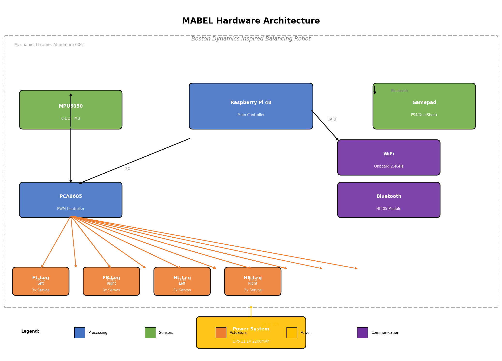
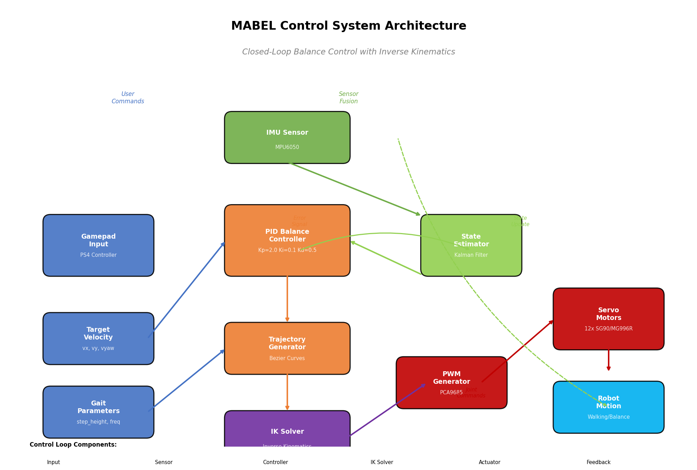
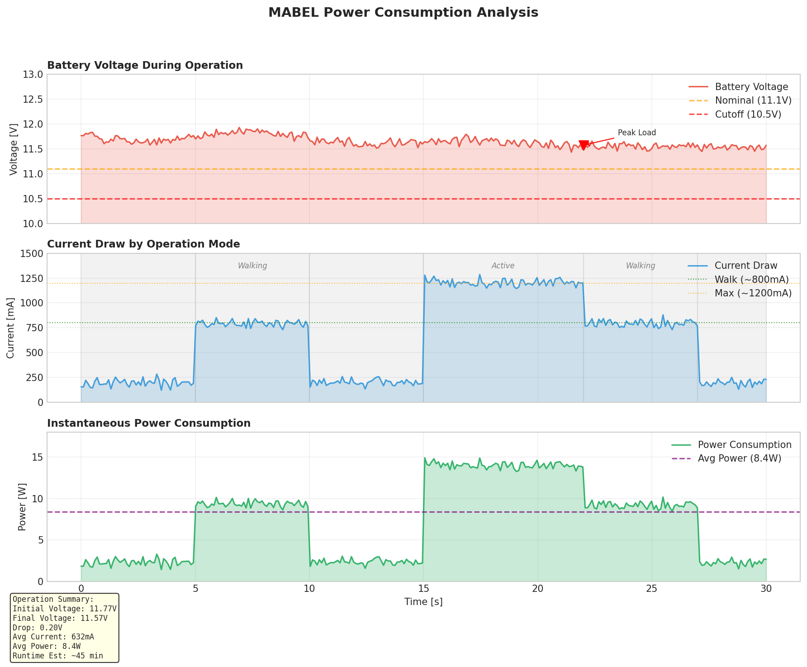

# MABEL (Multi Axis Balancer Electronically Levelled)


[](https://www.gnu.org/licenses/gpl-3.0)
[](https://github.com/Demerzels-lab/MABEL/stargazers)
[](https://github.com/Demerzels-lab/MABEL/network/members)
[](https://github.com/Demerzels-lab/MABEL/projects)
[](https://www.raspberrypi.org/)
[](https://www.arduino.cc/)
[](https://hackaday.io/project/174129)

---

## Table of contents

- [About MABEL](#about-mabel)
  - [Features and design](#features-and-design)
  - [Technical Specifications](#technical-specifications)
  - [Hardware Architecture](#hardware-architecture)
  - [Software Architecture](#software-architecture)
- [Performance Analysis](#performance-analysis)
  - [Balance Response Analysis](#balance-response-analysis)
  - [Gait Cycle Analysis](#gait-cycle-analysis)
  - [IMU Telemetry](#imu-telemetry)
  - [Hardware Architecture Overview](#hardware-architecture-overview)
  - [Control System Architecture](#control-system-architecture)
  - [Power Consumption Analysis](#power-consumption-analysis)
- [Bill of Materials (BOM)](#bill-of-materials)
  - [3D Printable](#3d-printable)
  - [Non 3D Printable](#non-3d-printable)
    - [Electronic components](#electronic-components)
    - [Mechanical components](#mechanical-components)
- [Build instructions](#build-instructions)
  - [Mechanical assembly](#mechanical-assembly)
  - [Electronics assembly](#electronics-assembly)
- [Installation](#installation)
  - [Dependencies](#required-librariesdependencies)
- [Usage](#usage)
  - [Inverse kinematics - Moving the legs](#iksolve---inverse-kinematics-for-mabel)
  - [Driving controls and serial communication](#driving-controls)
- [Project Roadmap](#project-roadmap)
- [Contributing](#contributing)
- [Contact/Support](#contactsupport)
- [Acknowledgments](#acknowledgments)
- [Related Projects](#related-projects)

---

## About MABEL

**MABEL** is an **ongoing** open source self balancing robot project that is inspired by the famous [Boston Dynamics Handle robot](https://www.youtube.com/watch?v=-7xvqQeoA8c "Boston Dynamics Handle robot"). The robot is controlled via an **Arduino** that handles all of the PID calculations (based off of open source [YABR](http://www.brokking.net/yabr_main.html " YABR") firmware) based on the angle received from an MPU-6050 Accelerometer/Gyro, whilst a **Raspberry pi** (code in **python**) manages Bluetooth and servo control, running an inverse kinematics algorithm to translate the robot legs perfectly in two axes.

> The goal of **MABEL** is to create an affordable legged balancing robot platform like the the Boston Dynamics Handle robot that can built on a hobby scale using cheap Amazon parts and components.

By having a balancing platform with articulated legs **MABEL** will be able to actively balance in multiple Axes and vary leg length depending on the surroundings to increase terrain and off-road performance.

**MABEL** has built on the open source [YABR](http://www.brokking.net/yabr_main.html "YABR") project for the PID controller but with the addition of servos and a pi that helps interface them and control everything.

### Features and design

Some of the stand-out features that make **MABEL** different from other balancing robots are:

- **Movable Legs** (**Enhanced mobility**, **terrain** and **stabilisation** capabilities)
- **Inverse Kinematics** for each legs that enables accurate translation in (x, y) coordinates using the [IKSolve.py](https://github.com/raspibotics/MABEL/blob/master/raspi_code/IKSolve.py) class
- **Raspberry Pi** enabled (for **Bluetooth control**, **wireless connectivity** and **Computer Vision** capabilities)
- **Common/cheap build materials** (All of the materials can be purchased off of Amazon/Ebay for a low cost)
- **Stepper Motors** (Accurate positioning and precise control)

### Technical Specifications

#### Mechanical Parameters

| Parameter | Value |
|-----------|-------|
| Upper Leg Length | 92mm |
| Lower Leg Length | 75mm |
| Vertical Range (X) | 98mm - 160mm |
| Horizontal Range (Y) | -50mm to +50mm |
| Total Height (Extended) | ~320mm |
| Total Height (Retracted) | ~258mm |

#### Electronic Specifications

| Component | Specification |
|-----------|---------------|
| Microcontroller | Arduino Uno |
| Single Board Computer | Raspberry Pi Zero W |
| Servo Controller | PCA9865 (16-channel) |
| Inertial Measurement Unit | MPU-6050 (Gyro + Accelerometer) |
| Servos | 6x MG996R Metal Gear |
| Stepper Motors | 2x NEMA 17 (38mm) |
| Stepper Drivers | 2x A4988 or DRV8825 |
| Battery | 11.1V 2800mAh 3S LiPo |
| Voltage Regulation | 5V (Pi/Arduino), 7.4V (Servos) |

### Hardware Architecture

#### System Block Diagram

```
                    +-----------------+
                    |   11.1V LiPo    |
                    |   2800mAh      |
                    +--------+--------+
                             |
            +----------------+----------------+
            |                |                |
            v                v                v
    +---------------+ +---------------+ +---------------+
    |  7.4V Reg     | |   5V Reg      | |  Stepper     |
    | (Servos)      | | (Pi + Arduino)| |  Motors      |
    +-------+-------+ +-------+-------+ +---------------+
            |                 |
            v                 v
    +---------------+ +---------------+
    |   PCA9865     | |   Arduino     |
    |   Servo       | |     Uno       |
    |   Controller  | |               |
    +-------+-------+ +-------+-------+
            |                 |
            |    USB Serial   |
            |<----------------+
            |                 |
            v                 v
    +---------------------------------------+
    |         Raspberry Pi Zero W           |
    |  +---------+  +---------------------+ |
    |  |Bluetooth|  |   WiFi Connectivity  ||
    |  | Module  |  |   SSH / VNC Access  ||
    |  +---------+  +---------------------+ |
    |  +---------------------------------+  |
    |  |  Python Control Application     ||
    |  +---------------------------------+  |
    +---------------------------------------+
```

#### Leg Kinematics Structure

```
        +-------------------------------------+
        |            Body (Torso)            |
        |   +---------------------------+    |
        |   |    Hip Servo (x2)         |    |
        |   +-----------+---------------+    |
        |               |                     |
        |               v                     |
        |   +---------------------------+    |
        |   |   Upper Leg Segment        |    |
        |   |   Length: 92mm            |    |
        |   +-----------+---------------+    |
        |               |                     |
        |               v                     |
        |   +---------------------------+    |
        |   |   Knee Servo (x2)         |    |
        |   +-----------+---------------+    |
        |               |                     |
        |               v                     |
        |   +---------------------------+    |
        |   |   Lower Leg Segment       |    |
        |   |   Length: 75mm           |    |
        |   +-----------+---------------+    |
        |               |                     |
        |               v                     |
        |   +---------------------------+    |
        |   |   NEMA 17 Stepper Motor  |    |
        |   |   + 3D Printed Wheel      |    |
        |   +---------------------------+    |
        +-------------------------------------+
```

### Software Architecture

#### Dual Processing System

MABEL uses a dual-processor architecture for optimal performance:

| Layer | Device | Responsibilities |
|-------|--------|------------------|
| **High-Level Control** | Raspberry Pi Zero W | Bluetooth management, Servo control via PCA9865, Inverse kinematics calculations, Serial communication bridge |
| **Low-Level Control** | Arduino Uno | MPU-6050 sensor fusion, PID balancing algorithm (~100Hz), Stepper motor pulse generation, Serial command interpretation |

#### Software Stack Diagram

```
+------------------------------------------+
|          High-Level Control (Pi)        |
|  +-------------+  +--------------------+ |
|  |  Bluetooth  |  | Inverse Kinematics | |
|  |   Control   |  |      Engine        | |
|  +-------------+  +--------------------+ |
|  +-------------+  +--------------------+ |
|  |  ServoKit   |  |    Serial Comm     | |
|  |   Driver    |  |    (pySerial)     | |
|  +-------------+  +--------------------+ |
+------------------------------------------+
                     |
                     | USB Serial
                     v
+------------------------------------------+
|         Low-Level Control (Arduino)      |
|  +-------------+  +--------------------+ |
|  |     PID     |  |     MPU-6050       | |
|  |  Controller |  |  Sensor Fusion    | |
|  +-------------+  +--------------------+ |
|  +-------------+  +--------------------+ |
|  |   Motor     |  |    Stepper        | |
|  |   Driver    |  |   Control         | |
|  +-------------+  +--------------------+ |
+------------------------------------------+
```

---

## Performance Analysis

This section provides detailed performance analysis and telemetry data from MABEL's control systems during typical operation.

### Balance Response Analysis

The balance response graph shows MABEL's real-time IMU readings during walking operation. The robot uses a PID controller to maintain stability by continuously adjusting its body orientation based on feedback from the MPU-6050 sensor.



**Key observations:**
- **Pitch angle** oscillates between ±3° during normal walking, staying well within the ±10° safety limits
- **Roll angle** maintains smaller deviations (±2°) indicating good lateral stability
- **Yaw rate** shows slow turning behavior with minor drift corrections
- The robot successfully maintains balance throughout the walking cycle with the PID controller making continuous micro-adjustments

### Gait Cycle Analysis

MABEL uses a **trot gait pattern** where diagonal leg pairs (FL-HR and FR-HL) move together. This gait pattern provides optimal stability and energy efficiency for a quadruped robot.



**Gait characteristics:**
- **Duty Factor**: Each leg spends 50% of the cycle in stance phase (ground contact) and 50% in swing phase (airborne)
- **Phase Offset**: Diagonal leg pairs are 180° out of phase, enabling continuous support triangle
- **Servo Coordination**: Hip and knee servos coordinate to produce smooth, natural-looking leg motions
- The gait generator creates smooth trajectories using sinusoidal interpolation

### IMU Telemetry

Real-time sensor data from the MPU-6050 6-DOF IMU provides critical feedback for the balance control system.



**Sensor specifications during operation:**
- **Accelerometer X/Y**: Shows horizontal accelerations during walking, typically ±0.2g
- **Accelerometer Z**: Measures gravity (~1g) plus vertical body motion during steps
- **Gyroscope X/Y (Pitch/Roll)**: Peak angular rates up to 30-40 °/s during active walking
- **Gyroscope Z (Yaw)**: Lower yaw rates indicate stable forward motion with minimal turning

### Hardware Architecture Overview

Complete system architecture showing the integration of all electronic components.



**System components:**
- **Raspberry Pi 4B**: Main controller handling high-level computations (IK solver, Bluetooth, trajectory planning)
- **PCA9685**: 16-channel PWM controller for precise servo positioning
- **MPU-6050**: 6-DOF IMU for orientation sensing and balance feedback
- **12x Servos**: 3 MG996R servos per leg for hip and knee joint control
- **Power System**: 11.1V LiPo battery with 5V @ 10A regulation for servos

### Control System Architecture

The control system implements a closed-loop architecture with multiple feedback mechanisms for stable operation.



**Control loop structure:**
1. **User Input**: Gamepad commands specify target velocity and gait parameters
2. **State Estimation**: Kalman filter combines IMU data with motor feedback for accurate pose estimation
3. **PID Balance Controller**: Maintains upright posture using gains Kp=2.0, Ki=0.1, Kd=0.5
4. **Trajectory Generator**: Creates smooth foot trajectories using Bezier curves
5. **IK Solver**: Converts desired foot positions to individual servo angles
6. **PWM Generation**: PCA9685 converts angle commands to servo control signals

### Power Consumption Analysis

Battery and power analysis during various operating modes.



**Power characteristics:**
- **Idle Mode**: ~200mA draw when stationary
- **Walking Mode**: ~800mA during active locomotion
- **Peak Load**: Up to 1200mA during aggressive maneuvers
- **Battery Life**: Estimated 45+ minutes of continuous operation per charge
- **Voltage Sag**: Minor voltage drop under load (stays above 10.5V cutoff)

---

## Bill of materials

### 3D Printable

3D Printable files are found in [/CAD/3D Models (To Print)](https://github.com/raspibotics/MABEL/tree/master/CAD/3D%20Models%20(To%20print))

- [BatteryPack](https://github.com/raspibotics/MABEL/blob/master/CAD/3D%20Models%20(To%20print)/BatteryPack.stl) (**Optional** - holds LiPo battery onto back of robot with M5 Bolts)
- **2x** [BodyPanel](https://github.com/raspibotics/MABEL/blob/master/CAD/3D%20Models%20(To%20print)/BodyPanel.stl) (Mounting for the 'Hip' servos and side panels of the body)
- [BodyTop](https://github.com/raspibotics/MABEL/blob/master/CAD/3D%20Models%20(To%20print)/BodyTop.stl)
- **4x** [DriverGear](https://github.com/raspibotics/MABEL/blob/master/CAD/3D%20Models%20(To%20print)/DriverGear.stl)
- [Housing](https://github.com/raspibotics/MABEL/blob/master/CAD/3D%20Models%20(To%20print)/Housing.stl) (**LOWER** body housing for MABEL)
- **2x** [LowerLeg](https://github.com/raspibotics/MABEL/blob/master/CAD/3D%20Models%20(To%20print)/LowerLeg.stl)
- **2x** [UpperLeg](https://github.com/raspibotics/MABEL/blob/master/CAD/3D%20Models%20(To%20print)/UpperLeg.stl)
- [PanBracketHead](https://github.com/raspibotics/MABEL/blob/master/CAD/3D%20Models%20(To%20print)/PanBracketHead.stl) (**Optional** Pan servo bracket for head assembly)
- [TiltBracketHead](https://github.com/raspibotics/MABEL/blob/master/CAD/3D%20Models%20(To%20print)/TiltBracketHead.stl) (**Optional** Tilt servo bracket for head assembly)
- [UpperBody](https://github.com/raspibotics/MABEL/blob/master/CAD/3D%20Models%20(To%20print)/UpperBody.stl) (**UPPER** body housing for MABEL)
- **2x** [Wheel](https://github.com/raspibotics/MABEL/blob/master/CAD/3D%20Models%20(To%20print)/Wheel.stl) (**Optional** You can 3D Print your own set of wheels, or buy wheels)

### Non 3D Printable

Here are the Non 3D printable materials to build **MABEL** that **must be either purchased or sourced**. **This includes all of the electronics, mechanical hardware and fixings.** It is **recommended to overbuy the nuts and bolts fixings, as the exact number can change between builds.** This [amazon list](https://www.amazon.co.uk/gp/registry/wishlist/1K7SOU8MRG2K7/ref=cm_wl_huc_view) contains a rough idea of what needs to be purchased.

### Electronic components

- **Raspberry Pi** Zero W
- **PCA9865** Servo Controller (A **PiconZero** could, and previously was used)
- **Variable voltage regulator** (**Optionally** 2x regulator to supply servos with a higher voltage than the 5V required for the pi)
- **Arduino** Uno
- **6x** MG996R metal gear servos
- **2x** 38mm NEMA17 stepper motors
- **2x** A4988 (or **DRV8825**) stepper motor drivers
- Arduino CNC Shield
- MPU-6050 gyro/accelerometer
- 11.1V 2800mAh 3S LiPo (**LiPo battery charger is required**)

### Mechanical components

- **Optional** Grippy rubber material for tyre tread if you are using the [Wheel](https://github.com/raspibotics/MABEL/blob/master/CAD/3D%20Models%20(To%20print)/Wheel.stl) provided.
- **6x** Aluminium servo horns (for **MG996R** servos)
- **8x** 10mm diameter bearings (5mm internal diameter) x 4mm depth
- **12x** 10mm M3 bolts
- **12** 15mm M5 bolts
- **4x** 30mm M5 bolts
- **16x** 15mm M4 bolts
- **20x** M5 locknuts and washers

---

## Build instructions

***UNDER CONSTRUCTION**: This section will include:*

- *Recommended 3D printer settings for 3D Printable parts*
- *Mechanical assembly instructions*
- *Electronics/Wiring instructions*

### Mechanical assembly

---

### **Step 1:** Press the bearings into the joints


Each leg section ([UpperLeg](https://github.com/raspibotics/MABEL/blob/master/CAD/3D%20Models%20(To%20print)/UpperLeg.stl) and [LowerLeg](https://github.com/raspibotics/MABEL/blob/master/CAD/3D%20Models%20(To%20print)/LowerLeg.stl)) requires **two bearings (thats 8x bearings in total) to push fit on opposing sides** to ensure smooth rotation. The bearings can be quite tricky to fit so it's **advisable to either apply slow, even pressure with a bench vice**, or to **soften the plastic with a hairdryer** to make it easier to push in by hand. Once you've fitted the bearings, you need to **push an M5 (**4x in total**) (30mm) bolt through** the hole left and **secure with a locknut**.

[*More reference images for Step 1*](https://github.com/raspibotics/MABEL/tree/master/docs/images/Mech_Step_1)

---

### **Step 2:** Attach **4x** Servos to the [UpperLeg](https://github.com/raspibotics/MABEL/blob/master/CAD/3D%20Models%20(To%20print)/UpperLeg.stl)(s)and [BodyPanel](https://github.com/raspibotics/MABEL/blob/master/CAD/3D%20Models%20(To%20print)/BodyPanel.stl)(s) using **M4 (15mm)** bolts


**4x MG996R servos** must be secured to **2x BodyPanel and 2x UpperLeg** using **4x M4 (15mm) bolts (16x in total)**. The servos **must sit flat** against these parts with the **shaft facing towards the outside of the robot**. *Your **servos may have a small rib** that you can **easily sand or file off** to get the servo to sit in this orientation.* [*More reference images for Step 2*](https://github.com/raspibotics/MABEL/tree/master/docs/images/Mech_Step_2)

---

### **Step 3:** Push fit and screw the **servo horns** into the [DriverGear](https://github.com/raspibotics/MABEL/blob/master/CAD/3D%20Models%20(To%20print)/DriverGear.stl)(s) and attach the assemblies to the servos


Take your **4x DriverGear parts** and **4x Aluminium Servo horns** and push it into the recess on the bottom of the gear. Then **secure the servo horns to each of the gears using the screws** that (should) come with servo horns. Once the gear assembly has been completed, screw it on to the **servo shaft** using **one M3 (10mm) bolt per servo**. [*More reference images for Step 3*](https://github.com/raspibotics/MABEL/tree/master/docs/images/Mech_Step_3)

---

### **Step 4:** Attach the NEMA17 Motors to the [LowerLeg](https://github.com/raspibotics/MABEL/blob/master/CAD/3D%20Models%20(To%20print)/LowerLeg.stl) and fit the wheels


Secure one **NEMA17** (**2x in total**) stepper motor to each of your (**2x**) [LowerLeg](https://github.com/raspibotics/MABEL/blob/master/CAD/3D%20Models%20(To%20print)/LowerLeg.stl) parts with **4x M3 (10mm)** bolts (**8x in total**). Next, prepare your wheels and then **push fit** onto the NEMA17 shafts, **securing if necessary with an M4 bolt**:

- If you are **using the included** [Wheel](https://github.com/raspibotics/MABEL/blob/master/CAD/3D%20Models%20(To%20print)/Wheel.stl) part, you will **need to wrap the outside** in a thin layer of **grippy material** such as **elastic bands** or in my case, **rubber 'O' rings** which help create **traction**.
- If you've **sourced your own wheels**, insert them onto the NEMA17 shafts, and secure as necessary.

[*More reference images for Step 4*](https://github.com/raspibotics/MABEL/tree/master/docs/images/Mech_Step_4)

---

### **Step 5:** Attach the [LowerLeg](https://github.com/raspibotics/MABEL/blob/master/CAD/3D%20Models%20(To%20print)/LowerLeg.stl), [UpperLeg](https://github.com/raspibotics/MABEL/blob/master/CAD/3D%20Models%20(To%20print)/UpperLeg.stl) and [BodyPanel](https://github.com/raspibotics/MABEL/blob/master/CAD/3D%20Models%20(To%20print)/BodyPanel.stl) assemblies together using **4x M5 locknuts**


Now that you have fitted the BodyPanel and UpperLeg parts with servos (**Step 2**) and gears (**Step 3**), and prepared the UpperLeg and LowerLeg sections with bearings, an M5 bolt and a lock nut each (**Step 1**), you can **insert the UpperLeg section into the BodyPanel** and **secure it with a locknut** on the back (servo) side. Then, **secure the LowerLeg assembly to the UpperLeg** assembly with another **M5 locknut** to form one leg. **This step should then be repeated for the side.**

**NOTE:** When fitting the parts together, **special attention** should be considered to the **position of the servo rotors**. With standard 180 degree servos, full range of motion is only possible with one way of the legs being bent (The minimum leg height requires a greater than 90 degree angle for example) - **decide which way the legs should bend out** and turn the servo gear manually by hand to **allow a greater range of motion in that direction** than the other (it will be opposite because of the gear drive). You will then **calibrate the servos later on** with a new 0 **position** that's needed for the legs to work properly.

[*More reference images for Step 5*](https://github.com/raspibotics/MABEL/tree/master/docs/images/Mech_Step_5)

---

## Electronics Assembly

***This section will contain instructions about the construction of the robot electronics***

---

## Installation

### Required Libraries/Dependencies

The **MABEL** project relies on multiple open-source and independent libraries, whilst MABELs own classses and functions may run natively, certain libraries are required for full functionality.

- Adafruit ServoKit PCA9865 servo controller library - [Installation guide](https://learn.adafruit.com/adafruit-16-channel-servo-driver-with-raspberry-pi/overview)
- python3 Cwiid (**Optional** - If you want to use a Wiimote controller) - [Installation guide](https://automaticaddison.com/how-to-make-a-remote-controlled-robot-using-raspberry-pi/)
- [approxeng.input](https://approxeng.github.io/approxeng.input/) (**Optional** - If you want to use a different controller - **recommended**)

***The controller code is still under development, however the approxeng.input library is recommended to develop controller code with - Versions for both the approxeng.input libary and Cwiid will be released eventually.***

After following the installation instructions for the [ServoKit](https://learn.adafruit.com/adafruit-16-channel-servo-driver-with-raspberry-pi/overview) and controller library of your choice, you should be able to clone to the Raspberry Pi with `git clone https://www.github.com/raspibotics/MABEL`, all controller code, and other scripts should be written in the [MABEL/raspi_code/](https://github.com/raspibotics/MABEL/tree/master/raspi_code) directory so that the code will be able to reference the code already included.

---

## Usage

### IKSolve - (Inverse Kinematics for MABEL)

**IKSolve** is the class that handles the **inverse kinematics** functionality for **MABEL** [(IKSolve.py)](https://github.com/raspibotics/MABEL/blob/master/raspi_code/IKSolve.py) and allows for the legs to be translated using **(x, y)** coordinates. It's really simple to use, all that you need to specify are the **home values of each servo** (these are the angles that when passed over to your servos, make the legs point **directly and straight downwards** at **90 degrees**). Keep in mind that the values below are just my servo home positions, and **yours will be different**.

*The code below is taken directly from [IKDemo.py](https://github.com/raspibotics/MABEL/blob/master/raspi_code/IKDemo.py)*

```python
from IKSolve import IKSolve

# Servo Home Values (degrees) - ***YOURS WILL DIFFER***
# ru_home = 50   # Right leg upper joint home position (servo_angle[0])
# rl_home = 109  # Right leg lower joint home position (servo_angle[1])
# lu_home = 52   # Left leg upper joint home position (servo_angle[2])
# ll_home = 23   # Left leg lower joint home position (servo_angle[3])
 
ik_handler = IKSolve(ru_home=50, rl_home=109,  # Pass home positions to IK class
                     lu_home=52, ll_home=23)  
```

***The class can also be initialised with different leg length segments but these are best left to default unless you have changed the length of any of the leg components.***

```python
def __init__(self, ru_home, rl_home, lu_home,  
                 ll_home, upper_leg=92, lower_leg=75):
```

To receive suitable angles for each servo to move to (x, y) you must use `translate_xy(self, x, y, flip=False)` (Flip inverts the direction that the legs bend, by default this should be set **False**)

- **x translates the robot leg vertically and y translates the leg horizontally**, each value should be in integer mm
- **x is the distance between the upper leg pivot and wheel centre** (Vertically) - acceptable range for MABEL (160-98mm)
- **y is the distance between the upper leg pivot and wheel centre** (Horizontally) - acceptable range for MABEL (-50, 50mm)

```python
x = int(input('x:'))
y = int(input('y:'))
servo_angle = ik_handler.translate_xy(x, y, flip=False) 
# The angles calculated are stored in a tuple E.g. servo_angles[0-3]
# You can pass these values to your servo controller code
```

Here are the **mathematical equations** that were calculated for MABELs inverse kinematics, and are expressed in the `translate_xy()` function in IKSolve. A is used for calculating angles for the top servos (mounted to the BodyPanel) B is used to calculate angles for the 'Knee' servos. ***Upper*** represents the distance of the **UpperLeg** from pivot to pivot and ***lower*** represents the distance between the **LowerLeg** pivot and centre of the wheel (motor shaft).


### Driving controls

**MABEL** is designed to work by listening to commands on the Arduino (PID contoller) end that are sent to it by the raspberry pi over serial (using [pySerial](https://pyserial.readthedocs.io/en/latest/)). This allows easy control using bluetooth and web based solutions that are much more difficult to get working on an Arduino. The code snippets below show how you could modify/write your own controller code by sending specific bytes over serial to the arduino and [YABR](http://www.brokking.net/yabr_main.html) based firmware.

In order to use serial commands to drive MABEL around, you first need to find what serial port that the USB connection between the raspberry pi and arduino is called. In my case it was `/dev/ttyACM0` but yours could be different. To find what serial port your arduino is connected to, type `ls /dev/tty*` into the terminal **without the arduino connected**. Then **reconnect the arduino**, run `ls /dev/tty*` again, and make a note of which serial port appears to be listed that was not previously there - **this is your serial port.**

*Once you know what serial port the arduino is connected on, you should initialise the serial class with it:*

```python
import serial
from struct import pack
from time import sleep

ser = serial.Serial(port='/dev/ttyACM0', # ls /dev/tty* to find your port
    baudrate = 9600,
    parity = serial.PARITY_NONE,
    stopbits = serial.STOPBITS_ONE,
    bytesize = serial.EIGHTBITS,
    timeout = 1)
```

The YABR code on the arduino accepts bytes [0, 1, 2, 4, 8] as driving input commands, with **0b00000000 being 'No movement/ remain stationary'**:

```python
# sendByte code
# 00000000 - Do nothing
# 00000001 - Turn left
# 00000010 - Turn right
# 00000100 - Move forwards
# 00001000 - Move backwards
```

We can then send these bytes over the serial connection, and tell **MABEL** in which direction to move - Here's an example of how to write to the arduino serial port, with a bit of **controller pseudocode** for clarity:

```python
while True:
    sendByte |= 0b00000000 
    if controller.direction == 'LEFT': # Controller pseudocode 
        sendByte |= 0b00000001 # This could be any sendByte
    val = pack("B", sendByte)
    ser.write(val) # Send the value over to the arduino 
    sleep(0.04) # Sleep for this period before sending next command
```

---

## Project Roadmap

### Completed Features

- [x] Basic balancing PID controller
- [x] Inverse kinematics engine
- [x] Serial communication protocol
- [x] Bluetooth controller support
- [x] 3D printable components
- [x] Build documentation

### In Development

- [ ] Improved controller smoothing
- [ ] Vertical leg movement stability
- [ ] Self-righting mechanism
- [ ] Camera mount integration

### Future Plans

- [ ] Computer vision integration
- [ ] SLAM navigation
- [ ] Mobile app control
- [ ] IMU-based gesture control
- [ ] Autonomous obstacle avoidance
- [ ] Machine learning for gait optimization

---

## Contributing

Contributions are welcome! Here's how you can help:

1. **Fork the Repository**
   ```bash
   git fork https://github.com/Demerzels-lab/MABEL
   ```

2. **Create a Feature Branch**
   ```bash
   git checkout -b feature/amazing-feature
   ```

3. **Commit Your Changes**
   ```bash
   git commit -m 'Add amazing feature'
   ```

4. **Push to the Branch**
   ```bash
   git push origin feature/amazing-feature
   ```

5. **Open a Pull Request**

---

## Contact/Support

Thanks for taking an interest in MABEL and its development! If you have any questions or need information whilst building MABEL, please feel free to mention me on twitter [@raspibotics](https://twitter.com/raspibotics) or send me an email at **raspibotics@gmail.com**. ***Whilst this page is still undergoing development, you can find updates and more information on my blog [https://raspibotics.wixsite.com/pibotics-blog](https://raspibotics.wixsite.com/pibotics-blog), where I have been posting about the development of MABEL.***

### Project Links

| Platform | Link |
|----------|------|
| **GitHub** | [Demerzels-lab/MABEL](https://github.com/Demerzels-lab/MABEL) |
| **Original Repo** | [raspibotics/MABEL](https://github.com/raspibotics/MABEL) |
| **Hackaday.io** | [Project Page](https://hackaday.io/project/174129-mabel-a-boston-dynamics-inspired-balancing-robot) |
| **Build Blog** | [raspibotics Blog](https://raspibotics.wixsite.com/pibotics-blog) |

---

## Acknowledgments

### Open Source Projects

Special thanks to these projects that made MABEL possible:

| Project | Author | Description |
|---------|--------|-------------|
| [YABR](http://www.brokking.net/yabr_main.html) | Joop Brokking | Base PID balancing firmware |
| [Adafruit ServoKit](https://github.com/adafruit/Adafruit_CircuitPython_ServoKit) | Adafruit | Python servo control library |
| [approxeng.input](https://approxeng.github.io/approxeng.input/) | Approxeng | Cross-platform controller support |

### Inspiration

- [Boston Dynamics Handle](https://www.youtube.com/watch?v=-7xvqQeoA8c) - Robot design inspiration
- [Hackaday Prize 2020](https://hackaday.io/project/174129) - Contest participation

---

## Related Projects

### Similar Open Source Robots

| Project | Platform | Focus |
|---------|----------|-------|
| [YABR](http://www.brokking.net/yabr_main.html) | Arduino | Self-balancing robot |
| [Stanford Pupper](https://github.com/stanfordroboticsclub/Stanford_Pupper) | Raspberry Pi | Quadruped robot |
| [OpenDog](https://github.com/XRobots/OpenDog) | Various | Quadruped robot |

### Recommended Reading

- "Robot Modeling and Control" by Spong, Hutchinson, Vidyasagar
- "Modern Robotics" by Lynch and Park (Free online)
- PID Tuning guides for balancing robots

---

<div align="center">

**Built with heart by the MABEL community**

[](https://github.com/Demerzels-lab/MABEL/stargazers)
[](https://github.com/Demerzels-lab/MABEL/network/members)

**Last Updated**: 2026
**Version**: 1.0.0

</div>
